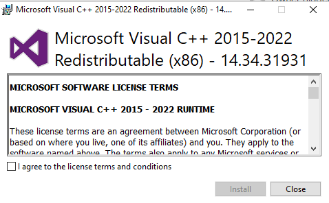

<h1>osTicket - Prerequisites and Installation</h1>
This tutorial outlines the prerequisites and installation of the open-source help desk ticketing system osTicket. 

<h2>Environments and Technologies Used</h2>

- Microsoft Azure (Virtual Machines/Compute)
- Remote Desktop
- Internet Information Services (IIS)

<h2>Operating Systems Used </h2>

- Windows 10</b> 

<h2>List of Prerequisites</h2>

- Enable IIS in Windows
- Install PHP manager and configure PHP
- Install Rewrite Module
- Set up my SQL Database
- Download and install osTicket

<h2>Installation Steps</h2>

Create a Resource Group and Azure Virtual Machine in Windows 10

Log into the VM with Remote Desktop

Within the VM (osticket-vm), download the osTicket-Installation-Files.zip and unzip it onto your desktop 

Install / Enable IIS in Windows WITH CGI 

From the “osTicket-Installation-Files” folder, install PHP Manager for IIS (PHPManagerForIIS_V1.5.0.msi)

From the “osTicket-Installation-Files” folder install the Rewrite Module (rewrite_amd64_en-US.msi) 

Create the directory C:\PHP

From the “osTicket-Installation-Files” folder, unzip PHP 7.3.8 (php-7.3.8-nts-Win32-VC15-x86.zip) into the “C:\PHP” folder

From the “osTicket-Installation-Files” folder, install VC_redist.x86.exe

From the “osTicket-Installation-Files” folder, install MySQL 5.5.62 (mysql-5.5.62-win32.msi) 

 
